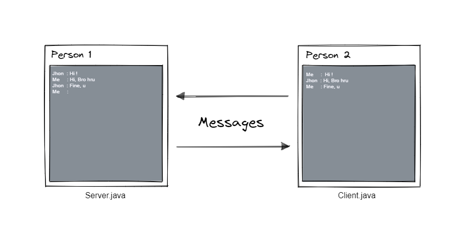

# Java Playground

Java Playground is a collection of simple Java projects designed to help you learn Java and its frameworks. The
repository covers various topics such as Swing, JavaFX, Spring framework, JVM languages, and more.

## Projects

The repository is organized into multiple modules, each with well-documented projects for exploration and practice.
These modules offer a comprehensive learning experience, allowing you to explore different aspects of Java development
at your own pace.

|   |                                                                                                                                                                                                                             |                                                     |
|---|-----------------------------------------------------------------------------------------------------------------------------------------------------------------------------------------------------------------------------|-----------------------------------------------------|
| 1 | [Guess the Number](guess) 🤔   A game where you need to guess a randomly generated target number within a certain number of attempts.                                                                                    |             |
| 2 | [Tic Tac Toe](tic-tac-toe) ⭕✖️⭕    A classic game implemented using Java Swing. Two players take turns placing their marks (X or O) on a 3x3 grid, aiming to get three in a row horizontally, vertically, or diagonally. |       |
| 3 | [ChitChat](chitchat) 💬    A basic chat application exploring the fundamentals of Java Socket programming and Java I/O Streams.                                                                                          |  |

## Getting Started

1. Clone the repository or download the source code as a ZIP file.
2. Open the project in your favorite Java development environment (e.g., Eclipse, IntelliJ IDEA).
3. Follow the instructions in each module's README.md.
4. Ensure you are using JDK 1.8 or above.

Happy coding!

> Don't forget to star the repository and follow for updates.