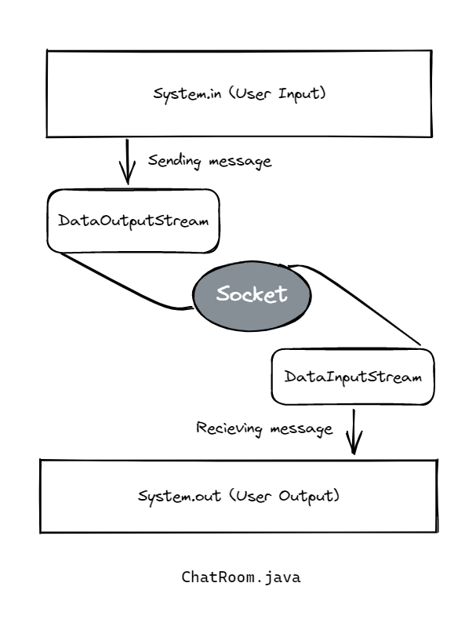

# ChitChat 💬

## Abstract ✍️
This project aimed to develop a chatting application from very basic, by exploring the fundamentals of programming and APIs those are listed below,
* Java Socket programming 
* Java I/O Streams 
* OOPs concepts 
* Core java 

Without any external libraries I just used JDK it provides hundreds of classes and number of APIs. The working principle is very simple and easy to understand, and it needs to having basic knowledge on Java networking, streams and fundamentals of Java programming. Initially it started by implementing the socket programming, and it follows these steps

1. Initialize ServerSocket and accept client.
3. get input message from the user.
4. Write some message to client through OutputStream.
5. Retrieve data from InputStream.
6. write message for user output.
7. that's it.
8. but same thing also happens on client side. Writing into OutputStream and Reading from InputStream.

For this reason ChatRoom class is used to centralize the io operations, and the below illustration gives the idea about ChatRoom class logic.

## Requirements 🏋🏻‍♂️
Java version 8 or higher.
## Installation ⚒️
1. Press the Fork button (top right the page) to save copy of this project on your account.
2. Download the repository files (project) from the download section or clone this project.
3. Imported it in Intellij IDEA or any other Java IDE.
4. Compile and run Server.java. Server must be run before Client.
5. Compile and run Client.java

> To exit from the chat write **STOP** from both.

## Contributing 💡
If you want to contribute to this project and make it better with new ideas, your pull request is very welcomed. If you find any issue just put it in the repository issue section, thank you.

Please ⭐ this repo and share it with others