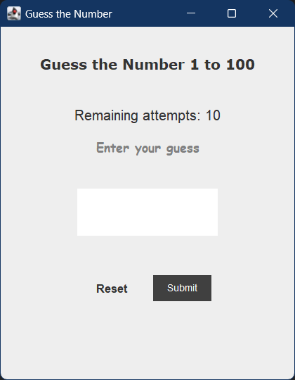

# Building Guess the number game

A game where you need to guess a randomly generated target number within a certain number of attempts.

> java Swing GUI toolkit
>Java 8 Method references & lambda expressions

### [SriMani-7/java-playground](https://github.com/SriMani-7/java-playground)

---

# User flow

- Player launches the game window.
- Player enters a guess and clicks "Submit".
- instruction displayed indicating if the guess is high, low, or correct.
- Player repeats steps 2-3 until they guess the correct number or run out of attempts.
- If they win, a congratulatory message is shown with the option to play again.
- if user has run out of attempts correct guess wil be displayed.

---

# Dive into code

1. **GuessPanel:** Main game panel with UI components & event handling.
2. **GuessGameLogic Class:** Handles game logic, generates random numbers, and evaluates guesses.
3. **GuessNumberWindow Class:** Sets up the JFrame window and adds the GuessPanel.

---

# Swing components & their purpose

- The **JFrame** is the main window of the game.
- **JLabel** displays text and messages to the player.
- **JTextField** lets players enter their guesses.
- **JButton** provides clickable buttons for actions like "Submit" and "Reset."
- **BoxLayout** arranges the game elements vertically.
- **Font** to style the text,
- **Color** to set the look of elements

---

## before you leaving

- ⭐ the [SriMani-7/java-playground](https://github.com/SriMani-7/java-playground) repo
- `git clone https://github.com/SriMani-7/java-playground.git`
- run **src\main\java\srimani7\playground\guess\GuessNumberWindow.java**
- play the game
- comment in how many attempts you guessed the correct answer.
