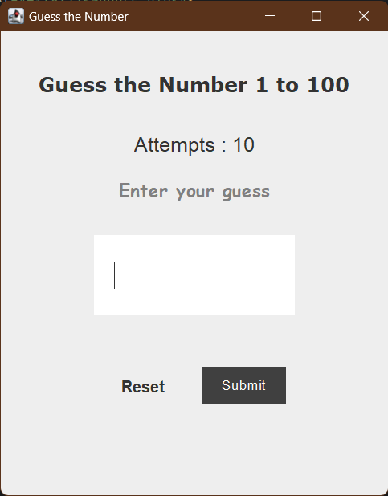
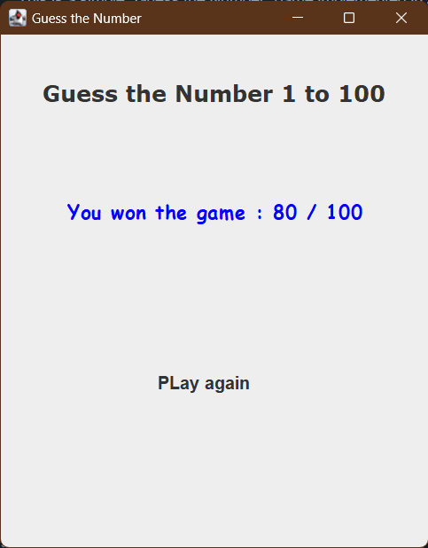

## Guess the Number 🤔

This is a simple "Guess the Number" game implemented in Java.
The game randomly generates a target number, and the player needs to guess the correct number within a certain number of
attempts.
### Screenshots

    
    

### Features

* Number of attempts = 10
* Maximum score = 100
* Allows the player to input their guess through a GUI-based input text field.
* Provides feedback to the player on whether their guess was too high, too low, or correct.
* Keeps track of the number of attempts made by the player.
* Displays a win/loss message with the correct number when the game is over.
* Provides an option to restart the game.

### Technologies Used

* JDK 1.8
* Swing (Java GUI library)
* **lambda** expressions
* **method references**

### Instructions

1. Run the main method in [GuessNumberWindow.java](guess%2Fsrc%2Fguess%2FGuessNumberWindow.java)
2. The game window will be displayed, and the player can start playing by entering their guesses in the input text field.
3. The game will provide feedback on each guess, and the player can continue guessing until they either guess the correct
4. number or exhaust their attempts.
5. Once the game is over, a win/loss message will be displayed, and the player can choose to restart the game if desired.