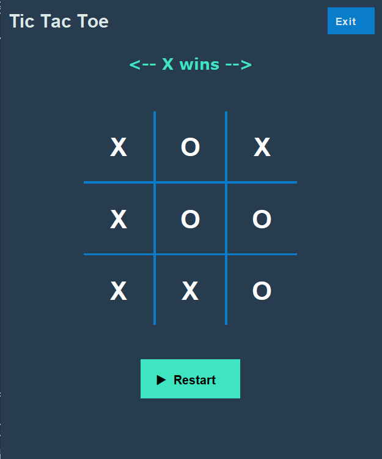
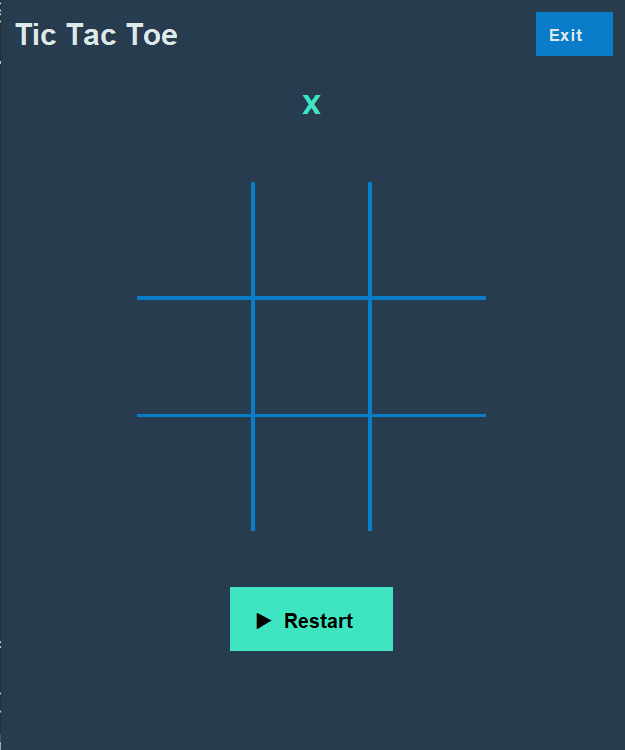

## Tic-Tac-Toe ⭕✖️⭕

Tic Tac Toe is a classic game that can be implemented using Java Swing. In this game, two players take turns placing
their respective marks (either X or O) on a 3x3 grid. The objective of the game is to get three of your marks in a row,
either horizontally, vertically, or diagonally.

### Screenshots

    
    

### Features

* colorful theme
* restart game
* custom toolbar

### Technologies Used

* JDK 18
* Swing (Java GUI library)
* **lambda** expressions
* **Switch expressions**

### Instructions

1. Run the main method in `TicTacToeWindow.java`
2. The game window will be displayed, and the player can start place their respective marks on grid.
3. The objective of the game is to get three of your maeks in a row, either horizontally, vertically or diagonally.
4. Player can restart / rest the game by clicking **restart** button.
5. To exit the game player can click **Exit button** at top right corner.